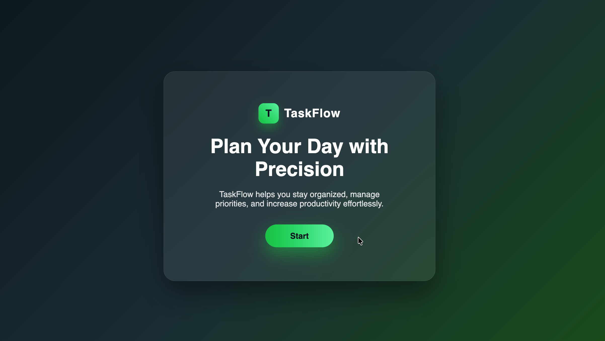
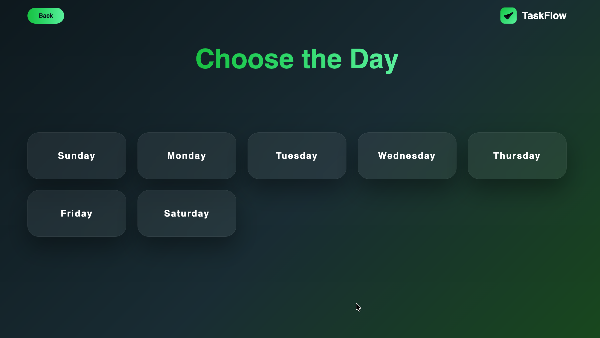
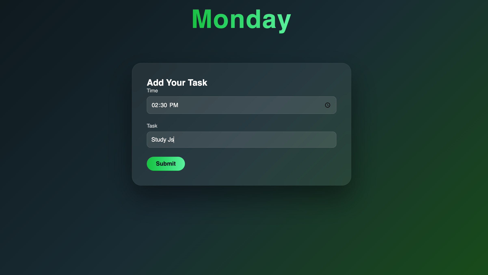
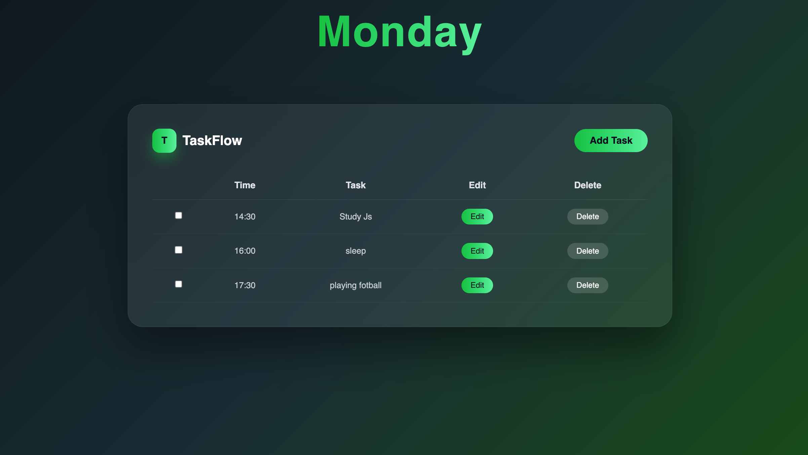

<h1 align="center">🚀 TaskFlow – Smart Daily To-Do Manager</h1>

<p align="center">
  <b>Plan Your Day with Precision</b><br>
  A modern, minimal and responsive day-wise task management web app built using pure HTML, CSS & JavaScript.
</p>

<p align="center">
  
  
  
  
  
</p>

---

# 🔥 Live Preview

⭐ **Experience the website live here:**  
👉 https://to-do-list-2-0-tlqh.vercel.app/

---

# 🎬 App Preview

## 🏠 Landing Page

<p align="center">
  
</p>

## 📅 Choose Day Interface

<p align="center">
  
</p>

## ➕ Add Task UI

<p align="center">
  
</p>

## 📋 Task List Table

<p align="center">
  
</p>

---

# ✨ Features

- ✅ Day-wise task management (Sunday – Saturday)
- ✅ Add tasks with specific time
- ✅ Edit tasks dynamically
- ✅ Delete tasks instantly
- ✅ Persistent storage using LocalStorage
- ✅ Modern glassmorphism UI
- ✅ Fully responsive layout
- ✅ Dynamic DOM manipulation
- ✅ Clean and minimal user experience

---

# 🛠️ Tech Stack

| Technology       | Purpose             |
| ---------------- | ------------------- |
| HTML5            | Structure           |
| CSS3             | Styling & UI Design |
| JavaScript (ES6) | Application Logic   |
| LocalStorage API | Data Persistence    |

---

# ⚙️ How It Works

Each day stores tasks separately in LocalStorage:

```
tasks_sunday
tasks_monday
tasks_tuesday
tasks_wednesday
tasks_thursday
tasks_friday
tasks_saturday
```

### On Page Load:

- Tasks are fetched from LocalStorage
- Table rows are generated dynamically
- UI updates instantly
- No backend required (Fully Frontend Project)

---

# ▶️ Run Locally

Follow these steps to run the project on your local machine:

## 📥 1️⃣ Clone the Repository

```bash
git clone https://github.com/your-username/To-Do-List-App-2.0.git
```

## 📂 2️⃣ Navigate to Project Folder

```bash
cd To-Do-List-App-2.0
```

## 🌐 3️⃣ Open in Browser

Simply open the `index.html` file in your browser:

- Double click `index.html`  
OR  
- Right click → Open With → Choose your browser  

---

## 💻 (Recommended) Run Using VS Code Live Server

If you're using VS Code:

1. Install the **Live Server** extension  
2. Right click on `index.html`  
3. Click **"Open with Live Server"**

This will:
- Run the app on `http://127.0.0.1:5500/`
- Auto reload when you make changes  

---

## 📦 No Installation Required

✅ No backend  
✅ No database  
✅ No dependencies  
✅ Fully frontend project  

Just open and use 🎉

---

# 📂 Project Structure

```
To-Do-List-App-2.0/
│
├── assets/
│   ├── banner.png
│   ├── Preview-1.png
│   ├── Preview-2.png
│   ├── Preview-3.png
│   ├── Preview-4.png
│   └── taskFlow.ico
│
├── css/
│   ├── style.css
│   └── days.css
│
├── js/
│   ├── sunday.js
│   ├── monday.js
│   ├── tuesday.js
│   ├── wednesday.js
│   ├── thursday.js
│   ├── friday.js
│   └── saturday.js
│
├── pages/
│   ├── sunday.html
│   ├── monday.html
│   ├── tuesday.html
│   ├── wednesday.html
│   ├── thursday.html
│   ├── friday.html
│   └── saturday.html
│
├── index.html
└── README.md
```

---

# 🚀 Future Improvements

- Dark / Light mode toggle
- Drag & Drop task reordering
- Task completion statistics
- Export tasks feature
- Backend integration

---

# 👨‍💻 Author

**Akash Wakade**

🎓 B.Tech Computer Science Student  
💻 Learning JavaScript & Web Development  

---

<p align="center">
  Built with ❤️ using JavaScript
</p>